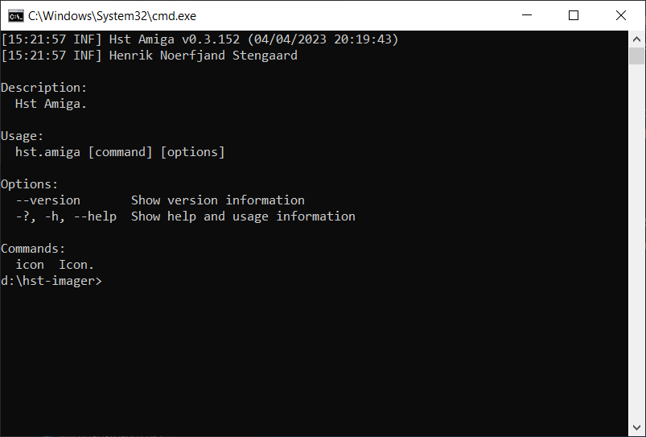

# Hst Amiga

Hst Amiga is a library for reading and writing Amiga partition table, file systems, data types and is available as a Nuget package for .Net and a console application.

## Features

Hst Amiga Nuget package contains following features:
- Data types:
  - Disk objects: Read, write disk objects containing icons and tool types. Supports planer, new icon and color icon images.
  - UAEFSDBs: Read and write UAEFSDB metadata files created by WinUAE.
  - UAE metafiles: Read and write UAE metafiles files created by FS-UAE.
- Read and write Rigid Disk Block (RDB), Amiga partition table.
- File systems
  - Read, write and format Fast File System (FFS) partitions. Supports DOS types DOS0-7.
  - Read, write and format Professional File System 3 (PFS3) partitions. Supports DOS types PFS3, PDS3.
- Read version strings.

Hst Amiga console version comes with following features:
- Icons
  - Create and update icons.
  - Import and export icon images, supporting iff, png and bmp image formats.
  - Convert icon images between bit plane, new icon and color icons.
- EPROMs
  - Build EPROMs from Amiga Kickstart ROMs for A500, A600, A2000, A1200, A3000 and A4000.
  - Fill EPROMs by concatenating Kickstart ROM until EPROM size is reached or fill EPROM with zeroes until EPROM size is reached.
  - Byte swap EPROMs.

## Versions

Hst Amiga comes as a Nuget package and a console application.

## Supported operating systems

Hst Amiga console supports following operating systems:
- Windows
- macOS
- Linux

## Hst Amiga Nuget package

Hst Amiga Nuget package is available at https://www.nuget.org/packages/Hst.Amiga.

## Hst Amiga console

See [Hst Amiga console](src/Hst.Amiga.ConsoleApp#hst-amiga-console) page for installation and usage of Hst Amiga console.
