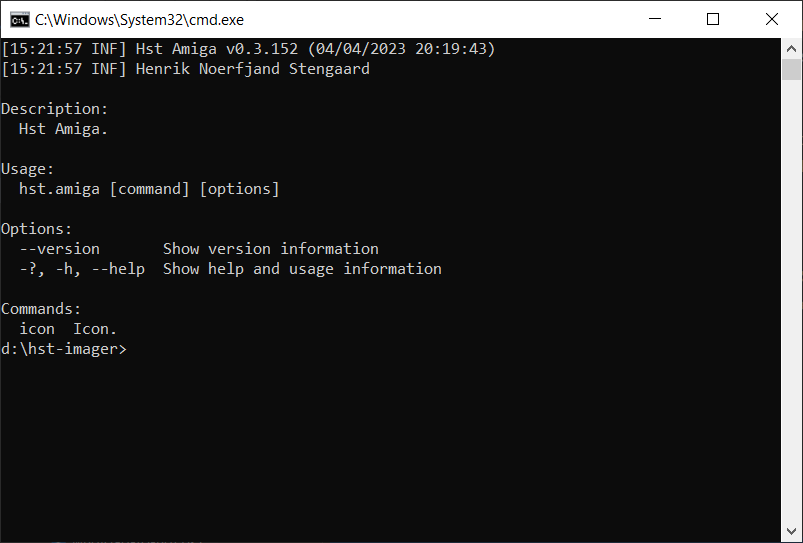

# Hst Amiga console

[](../../assets/hst-amiga-console.png)

Hst Amiga console is an application to create, read and write Amiga related data files. 

## Features

Hst Amiga Console version comes with following features:
- Icons
    - Create and update icons.
    - Import and export icon images, supporting iff, png and bmp image formats.
    - Convert icon images between bit plane, new icon and color icons.

## Supported operating systems

Hst Amiga supports following operating systems:
- Windows
- macOS
- Linux

## Installation

- Download latest Hst Amiga console version from [releases](https://github.com/henrikstengaard/hst-amiga/releases).
- Extract Hst Amiga console zip file.

Hst Amiga is now ready to use.

## Usage

Hst Amiga console application is invoked from the command line using the `hst.amiga` command.

Invoking `hst.amiga` command without any arguments, will display available commands and options.

Example of displaying usage:
```
hst.amiga
```

The command line options for the Hst Amiga console application are listed in the following sections.

## Icon commands

### Display information about icon

Displays information about an icon.

Example of displaying usage for icon info:
```
hst.amiga icon info
```

Example of displaying information about icon info "disk.info":
```
hst.amiga icon info disk.info
```

### Create new icon

Create a new icon file and optionally import icon images.

Hst Amiga can create following icon image types:
- Planar
- NewIcon
- Color icon

Hst Amiga can read icon image from following image formats:
- Png
- Bmp

Example of displaying usage for create icon:
```
hst.amiga icon create 
```

Example of creating a new icon file "disk.info" of icon type "Disk":
```
hst.amiga icon create disk.info disk
```

Example of creating a new icon file "disk.info" of icon type "Disk" and import planar icon image files "image1.png" and "image2.png":
```
hst.amiga icon create disk.info disk --image-type planar --image1-path image1.png --image2-path image2.png
```

### Convert icon images

Convert icon images from one type to another.

Hst Amiga can convert between following icon image types:
- Planar
- New icon
- Color icon

Example of displaying usage for convert icon images:
```
hst.amiga icon image convert
```

Example of converting planar icon images to new icon images for icon file "disk.info":
```
hst.amiga icon image convert disk.info planar newicon
```

Example of converting planar icon images to color icon images for icon file "disk.info":
```
hst.amiga icon image convert disk.info planar coloricon
```

Example of converting auto detected icon images (in order color icon, new icon and planar) to color icon images for icon file "disk.info":
```
hst.amiga icon image convert disk.info auto coloricon
```

### Delete icon images

Delete icon images from an icon file.

Example of displaying usage for delete icon images:
```
hst.amiga icon image delete
```

Example of deleting all icon images from icon file "disk.info":
```
hst.amiga icon image delete disk.info
```

Example of deleting planar icon images from icon file "disk.info":
```
hst.amiga icon image delete disk.info planar
```

Example of deleting new icon images from icon file "disk.info":
```
hst.amiga icon image delete disk.info newicon
```

### Export icon images

Export icon images from an icon file.

Hst Amiga can export following icon image types:
- Planar
- New icon
- Color icon

Hst Amiga can write icon image in following image formats:
- Png
- Bmp

Example of displaying usage for export icon images:
```
hst.amiga icon image export
```

Example of exporting planar icon images from icon file "disk.info" and save planar icon images as "image1.png" and "image2.png":
```
hst.amiga icon image export disk.info planar --image1-path image1.png --image2-path image2.png
```

Example of exporting planar icon images from icon file "disk.info" using palette file "full-palette.json" and save planar icon images as "image1.png" and "image2.png":
```
hst.amiga icon image export disk.info planar --image1-path image1.png --image2-path image2.png --palette-path "palettes/full-palette.json"
```

Example of exporting new icon images from icon file "disk.info" and save new icon images as "image1.png" and "image2.png":
```
hst.amiga icon image export disk.info newicon --image1-path image1.png --image2-path image2.png
```

Example of exporting color icon images from icon file "disk.info" and save color icon images as "image1.png" and "image2.png":
```
hst.amiga icon image export disk.info coloricon --image1-path image1.png --image2-path image2.png
```

### Import icon images

Import icon images to an icon file.

Hst Amiga can import following icon image types:
- Planar
- New icon
- Color icon

Hst Amiga can read icon image from following image formats:
- Png
- Bmp

Example of displaying usage for import icon images:
```
hst.amiga icon image import
```

Example of importing image files "image1.png" and "image2.png" as planar icon images in icon file "disk.info":
```
hst.amiga icon image import disk.info planar --image1-path image1.png --image2-path image2.png
```

Example of importing image files "image1.png" and "image2.png" as new icon images in icon file "disk.info":
```
hst.amiga icon image import disk.info newicon --image1-path image1.png --image2-path image2.png
```

Example of importing image files "image1.png" and "image2.png" as color icon images in icon file "disk.info":
```
hst.amiga icon image import disk.info coloricon --image1-path image1.png --image2-path image2.png
```

### Import tool types

Import tool types to an icon file.

Example of displaying usage for import icon images:
```
hst.amiga icon tooltypes import
```

Example of importing tool types from text file "tooltypes.txt" to in icon file "disk.info":
```
hst.amiga icon tooltypes import disk.info tooltypes.txt
```

Example of importing tool types from text file "tooltypes.txt" to in icon file "disk.info" and preserve new icon images in icon file:
```
hst.amiga icon tooltypes import disk.info tooltypes.txt --preserve-newicon
```

### Export tool types

Export tool types from an icon file.

Example of displaying usage for export icon images:
```
hst.amiga icon tooltypes export
```

Example of exporting tool types from icon file "disk.info" to text file "tooltypes.txt":
```
hst.amiga icon tooltypes import disk.info tooltypes.txt
```

Example of exporting tool types from icon file "disk.info" to text file "tooltypes.txt" exclude new icon from tool types:
```
hst.amiga icon tooltypes import disk.info tooltypes.txt --exclude-newicon
```

### Update icon

Updates icon properties:
- Type
- X position
- Y position
- Stack size
- Drawer properties for Disk, Drawer and Garbage icon types that opens a drawer window when double clicked:
  - Drawer X position
  - Drawer Y position
  - Drawer width
  - Drawer height

Example of displaying usage for updating icon:
```
hst.amiga icon update
```

Example of updating x position to 100 and y position to 100 for icon file "disk.info":
```
hst.amiga icon update disk.info -x 100 -y 100
```

Example of updating drawer x position to 100, drawer y position to 100, drawer width to 200 and drawer height to 100 for icon file "disk.info":
```
hst.amiga icon update disk.info --drawer-x 100 --drawer-y 100 --drawer-width 200 --drawer-height 100
```

## EPROM commands

### Build EPROM for A500

Build EPROM `.bin` files for A500 from a kickstart ROM file.
The kickstart ROM is byte swapped and padded to fit the EPROM size.

Example of displaying usage for build EPROM for A500:
```
hst.amiga eprom build a500
```

Example of building EPROM for A500 from AmigaOS 3.2 kickstart ROM file `kickCDTVa1000a500a2000a600.rom`:
```
hst.amiga eprom build a500 kickCDTVa1000a500a2000a600.rom
```

Example of building EPROM for A500 from AmigaOS 3.2 kickstart ROM file `kickCDTVa1000a500a2000a600.rom` for an AM27C800 EPROM:
```
hst.amiga eprom build a500 kickCDTVa1000a500a2000a600.rom -e am27c800
```

Example of building EPROM for A500 from AmigaOS 3.2 kickstart ROM file `kickCDTVa1000a500a2000a600.rom` for an EPROM of size 1048576 bytes:
```
hst.amiga eprom build a500 kickCDTVa1000a500a2000a600.rom -s 1048576
```

### Build EPROM for A600

Build EPROM `.bin` files for A600 from a kickstart ROM file.
The kickstart ROM is byte swapped and padded to fit the EPROM size.

Example of displaying usage for build EPROM for A600:
```
hst.amiga eprom build a600
```

Example of building EPROM for A600 from AmigaOS 3.2 kickstart ROM file `kickCDTVa1000a500a2000a600.rom`:
```
hst.amiga eprom build a600 kickCDTVa1000a500a2000a600.rom
```

Example of building EPROM for A600 from AmigaOS 3.2 kickstart ROM file `kickCDTVa1000a500a2000a600.rom` for an AM27C800 EPROM:
```
hst.amiga eprom build a600 kickCDTVa1000a500a2000a600.rom -e am27c800
```

Example of building EPROM for A600 from AmigaOS 3.2 kickstart ROM file `kickCDTVa1000a500a2000a600.rom` for an EPROM of size 1048576 bytes:
```
hst.amiga eprom build a600 kickCDTVa1000a500a2000a600.rom -s 1048576
```

### Build EPROM for A2000

Build EPROM `.bin` files for A2000 from a kickstart ROM file.
The kickstart ROM is byte swapped and padded to fit the EPROM size.

Example of displaying usage for build EPROM for A2000:
```
hst.amiga eprom build a2000
```

Example of building EPROM for A2000 from AmigaOS 3.2 kickstart ROM file `kickCDTVa1000a500a2000a600.rom`:
```
hst.amiga eprom build a2000 kickCDTVa1000a500a2000a600.rom
```

Example of building EPROM for A2000 from AmigaOS 3.2 kickstart ROM file `kickCDTVa1000a500a2000a600.rom` for an AM27C800 EPROM:
```
hst.amiga eprom build a2000 kickCDTVa1000a500a2000a600.rom -e am27c800
```

Example of building EPROM for A2000 from AmigaOS 3.2 kickstart ROM file `kickCDTVa1000a500a2000a600.rom` for an EPROM of size 1048576 bytes:
```
hst.amiga eprom build a2000 kickCDTVa1000a500a2000a600.rom -s 1048576
```

### Build EPROM for A1200

Build EPROM `.bin` files for A1200 from a kickstart ROM file.
The kickstart ROM is split into hi and lo EPROMs by word size, byte swapped and padded to fit the EPROM size.

Example of displaying usage for build EPROM for A1200:
```
hst.amiga eprom build a1200
```

Example of building EPROM for A1200 from AmigaOS 3.2 kickstart ROM file `kicka1200.rom`:
```
hst.amiga eprom build a1200 kicka1200.rom
```

Example of building EPROM for A1200 from AmigaOS 3.2 kickstart ROM file `kicka1200.rom` for an AM27C800 EPROM:
```
hst.amiga eprom build a1200 kicka1200.rom -e am27c800
```

Example of building EPROM for A1200 from AmigaOS 3.2 kickstart ROM file `kicka1200.rom` for an EPROM of size 1048576 bytes:
```
hst.amiga eprom build a1200 kicka1200.rom -s 1048576
```

### Build EPROM for A3000

Build EPROM `.bin` files for A3000 from a kickstart ROM file.
The kickstart ROM is split into hi and lo EPROMs by word size, byte swapped and padded to fit the EPROM size.

Example of displaying usage for build EPROM for A3000:
```
hst.amiga eprom build a3000
```

Example of building EPROM for A3000 from kickstart ROM file `kicka3000.rom`:
```
hst.amiga eprom build a3000 kicka3000.rom
```

Example of building EPROM for A3000 from AmigaOS 3.2 kickstart ROM file `kicka3000.rom` for an AM27C800 EPROM:
```
hst.amiga eprom build a3000 kicka3000.rom -e am27c800
```

Example of building EPROM for A3000 from AmigaOS 3.2 kickstart ROM file `kicka3000.rom` for an EPROM of size 1048576 bytes:
```
hst.amiga eprom build a3000 kicka3000.rom -s 1048576
```

### Build EPROM for A4000

Build EPROM `.bin` files for A4000 from a kickstart ROM file.
The kickstart ROM is split into hi and lo EPROMs by word size, byte swapped and padded to fit the EPROM size.

Example of displaying usage for build EPROM for A4000:
```
hst.amiga eprom build a4000
```

Example of building EPROM for A4000 from kickstart ROM file `kicka4000.rom`:
```
hst.amiga eprom build a4000 kicka4000.rom
```

Example of building EPROM for A4000 from AmigaOS 3.2 kickstart ROM file `kicka4000.rom` for an AM27C800 EPROM:
```
hst.amiga eprom build a4000 kicka4000.rom -e am27c800
```

Example of building EPROM for A4000 from AmigaOS 3.2 kickstart ROM file `kicka4000.rom` for an EPROM of size 1048576 bytes:
```
hst.amiga eprom build a4000 kicka4000.rom -s 1048576
```